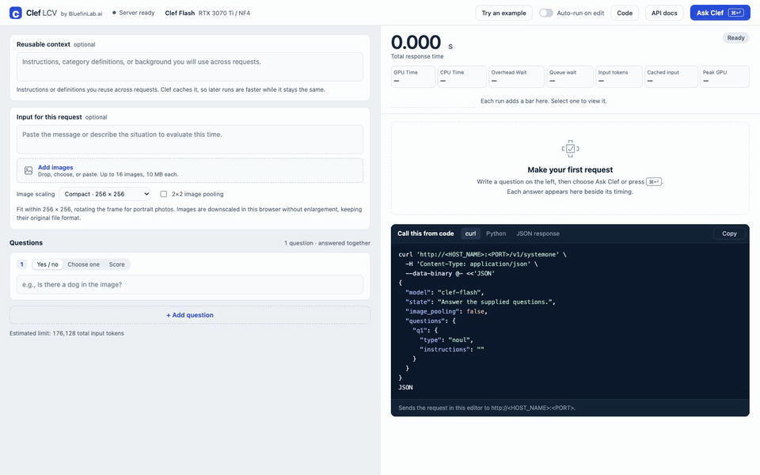

# Clef LCV

**Clef Local Inference, Caching, and Vision**

A self-hosted portal and API for Cloudflare's Clef decision models. Give it
context, one or more questions, and optional images; it returns typed answers
with probabilities and shows how long the browser round trip and server
inference took. It runs on a single NVIDIA GPU using 4-bit (NF4) weights, with an opt-in
[RX 580 community ROCm path](experimental/rocm/README.md).

**Live demo:** [bluefinlab.ai](https://bluefinlab.ai), Clef Flash on a single RTX 3070 Ti 8 GB. Built by [Bluefin Lab](https://bluefinlab.ai).



*Recorded against the live Clef Flash server on an RTX 3070 Ti: two questions about one photo, then a second run that reuses the cached image.*

## Why Clef LCV

There are plenty of ways to classify text with a model. This project fills
a narrower need: a high-quality decision model that runs entirely on local
hardware and can decide based on what's in an image, not just text.

The requirements were:

- **Quality:** categorization on par with GPT Sol 6.1, the hosted reference model.
- **Images:** decisions based on image content as well as text.
- **Accessibility:** works offline and in air-gapped environments, with no calls
  to hosted services once the model is prepared.
- **Speed:** fast enough for interactive use on a single GPU.

### Decision models we tested

Each model classified the same [100 synthetic emails](benchmarks/email-sample/README.md)
into twelve categories with the same guide. The reference labels are GPT Sol 6.1's
categorizations of those emails, so "Matches GPT Sol 6.1" is how many of a model's
answers agreed with the reference model. Serial time is for all 100 emails, sent
one at a time.

| Model | Runs locally | Image input tested | Matches GPT Sol 6.1 | Serial time | Hardware |
|---|---|---|---:|---:|---|
| JEV 1.13.0 | No, hosted API | Not tested | 100/100 | 18.2 s | Hosted |
| Laya | Yes | Not tested | 42/100 | 14.0 s | RTX 2080 Ti |
| Laya Typed Decisions | Yes | Not tested | 36/100 | 14.1 s | RTX 2080 Ti |
| Decider 2B v11 | Yes | Not tested | 94/100 | 48.3 s | RTX 2080 Ti |
| Kev-4B Q8_0 | Yes | Not tested | 96/100 | 129.2 s | RTX 2080 Ti |
| Kev-9B Q4_K_M, community | Yes | Not tested | 100/100 | 179.4 s | RTX 2080 Ti |
| **Clef Flash 9B (this project)** | Yes | Yes, up to 16 per request | 96/100 | 65.2 s | RTX 2080 Ti |
| **Clef Flash 9B (this project)** | Yes | Yes, up to 16 per request | 96/100 | 60.0 s | RTX 3070 Ti |
| **Clef Flash 9B (this project)** | Yes | Yes, up to 16 per request | 96/100 | 43.4 s | RTX 3090 |
| **Clef Full 27B (this project)** | Yes | Yes, up to 16 per request | 100/100 | 126.4 s | RTX 3090 |

Most models ran on different GPUs and runtimes, and some were run outside their
default settings, so treat this as a fit-for-purpose check rather than a ranking.
Clef Flash gave the same answers on all three GPUs it was tested on.
Configurations, concurrent timings and caveats are in the
[comparison results](benchmarks/provider-comparison/README.md). Hosted
general-purpose models such as GPT Sol 6.1 aren't included in the published results.

### Where Clef fits

- **Clef Full** matched GPT Sol 6.1 on all 100 emails, runs locally and takes images.
  Kev-9B also matched all 100, but was slower in our tests and wasn't tested
  with images. JEV was fast and accurate, but needs an internet connection and
  an API key.
- **Clef Flash** gives up 4 of 100 matches for about three times Full's speed on
  the same RTX 3090, and runs on GPUs with 8 GB. On the RTX 2080 Ti used for the
  other local models, it was about 2.8 times faster than Kev-9B.
- **Offline:** once the weights are prepared, the service runs with `--offline`
  and makes no network calls. For an air-gapped host, prepare the model on a
  connected machine, then move the image and the prepared checkpoint across. See
  [reusing prepared weights](docs/unified-service.md#reuse-existing-prepared-weights).
- **Speed:** sent one at a time, Flash takes about 0.43 s per email on an
  RTX 3090 and 0.65 s on an RTX 2080 Ti; Full takes about 1.3 s on an RTX 3090.

## Models

Two models are supported:

| Profile | Model | Weights | Compute | Minimum GPU | Tested on |
|---|---|---|---|---|---|
| Flash (default) | Clef Flash 9B | NF4, compact NF4 embeddings | FP16 | 8 GB | RTX 3070 Ti, RTX 2080 Ti, RTX 3090 |
| Full | Clef 27B | NF4, dense BF16 embeddings | BF16 | 22 GiB with BF16 support | RTX 3090 |

## Features

- **Decision questions:** several `noul` (probability of yes), `choice` and
  `score` questions per request, answered together.
- **Images:** up to 16 per request by file picker, drag and drop or paste.
  The browser resizes them to a chosen preset, from Compact (256 × 256) to
  Original, keeping the PNG, JPEG or WebP format.
- **Testing portal:** the editor and response sit side by side. Each answer shows
  its confidence change since the last run and dims when its question is edited.
  Run with Cmd/Ctrl+Enter or optional auto-run, and mark answers correct or wrong.
- **Code examples:** copyable curl and Python for the request in the editor,
  using the server's own address and model ID.
- **Caching:** a radix-tree prefix cache in GPU memory and system RAM, so repeated
  context and images aren't processed twice. See [caching](#how-caching-works).
- **Long context:** requests up to 131K tokens tested, with the model's memory
  automatically moved between GPU and RAM as needed. See [long context](#long-context).
- **Capacity:** input limits are computed from the GPU's free memory and reported
  by `/v1/models`. Oversized requests are rejected rather than truncated.
- **Serving:** a bounded queue in front of one GPU worker. On RTX 30-series (SM86)
  GPUs, small text requests that arrive together run two at a time. Includes
  `/health`, `/v1/models`, `/v1/systemone` and interactive API docs at `/docs`.

## Caching and long context

### How caching works

Most requests repeat something: the same category guide, the same instructions,
the same images. Clef LCV keeps the model's computed state for those shared
beginnings, so a later request only processes what's new.

- **Exact prefix reuse.** If a request starts with the same tokens as an earlier
  one (same reusable context, same images in the same order, same scaling and
  pooling), the saved state for that shared part is reused. Only the remainder is
  processed. Similar but not identical text is not a match. Answers are never
  cached: the questions and the decision head are computed fresh every time.
- **Radix-tree index.** Following the approach of
  [SGLang's RadixAttention](https://github.com/sgl-project/sglang), cached
  prefixes are indexed in a compressed radix tree of token IDs. Requests that
  branch from a common guide share its entry, and lookup finds the longest
  matching prefix directly. The index is this project's own implementation.
- **Two memory tiers, no disk.** Checkpoints live in GPU memory while there is
  room, sized automatically around the model and the active request. When the GPU
  needs space, they move to system RAM instead of being dropped. The RAM tier
  grows as needed while leaving 25% of available memory free, respects container
  memory limits, and evicts the least-frequently-used entries first. Cached state
  is never written to disk, so the caches start empty after each restart. (Only
  small memory-calibration records are saved, so routing decisions survive restarts.)
- **Images too.** Processed images are kept in RAM, and image encodings on the
  GPU. Language-state checkpoints after each complete image let an unchanged
  leading sequence survive replacing, removing or appending later images.
  `[A, B, C, D, E]` can become `[A, B, C, D, F]` by restoring through D and
  processing F plus the following text/questions. The response reports
  `vision_images_reused`; memory limits and eviction still apply. Small inputs
  may cost more snapshot work than they save. See
  [image-boundary reuse](docs/unified-service.md#image-boundary-prefix-reuse).

In the email benchmark, each request reused about 1,536 tokens, mostly the shared
category guide. Each response reports `reused_prefix_tokens` and
`prefix_cache_tier` (`gpu`, `cpu` or `miss`), and the portal shows them as
**Cached input**. `/health` has hit, eviction and memory statistics. Set
`CLEF_PREFIX_HOST_CACHE_MIB=0` to turn off the RAM tier. See
[caching controls](docs/runtime-optimizations.md#cpu-backed-prefix-checkpoints).

### Long context

Each request takes the fastest path that fits in GPU memory, chosen automatically
from free memory and measured peaks rather than a fixed token cutoff:

1. **GPU native:** everything stays on the GPU.
2. **GPU tiled:** the attention cache stays on the GPU, but is read in blocks to
   reduce peak memory.
3. **CPU streamed:** the attention cache lives in system RAM and is streamed to
   the GPU in bounded pieces.

Long requests use the same prefix cache, so a repeated long document is fast
after the first pass. Physical tests with synthetic documents, each containing
facts placed at the beginning, middle and end:

| Model and GPU | Input tokens | Path | First run | Cached repeat |
|---|---:|---|---:|---:|
| Flash, RTX 3070 Ti 8 GB | 40,923 | GPU tiled | 22.3 s | 1.4 s |
| Flash, RTX 3070 Ti 8 GB | 131,196 | CPU streamed | 106.9 s | 3.9 s |
| Flash, RTX 3090 24 GB | 131,196 | GPU native | 94.2 s | 1.3 s |
| Full, RTX 3090 24 GB | 65,499 | GPU tiled | 96.1 s | 3.7 s |
| Full, RTX 3090 24 GB | 131,196 | CPU streamed | 243.6 s | 5.4 s |

Every run recovered all of the planted facts. These are individual observations,
not maximum capacity or a general accuracy guarantee; see
[known limitations](#known-limitations). `/v1/models` reports the current limit
for each path, with and without cache help. A request that can't fit even with
its cached prefix returns 413 rather than being truncated. See
[adaptive routing](docs/runtime-optimizations.md#adaptive-nvidia-routing-and-cache-reuse)
and the [recorded results](benchmarks/adaptive-context/README.md).

## Requirements

| | |
|---|---|
| GPU | One NVIDIA GPU, compute capability 7.5 (Turing) or newer. Flash needs 8 GB; Full needs 22 GiB and BF16. |
| Host | Linux x86_64 with an NVIDIA driver for CUDA 12.9 or later: `nvidia-smi` should report CUDA Version 12.9+ (driver R575 or newer). Older drivers are untested. |
| Docker | Docker with the [NVIDIA Container Toolkit](https://docs.nvidia.com/datacenter/cloud-native/container-toolkit/latest/install-guide.html) |
| Disk | About 30 GB free for Flash or 85 GB for Full, plus the Docker image |
| RAM | System RAM is used while preparing weights (Full stages large embedding tensors), for long-context streaming and for the RAM cache tier |

macOS, CPU-only hosts and NVIDIA GPUs older than Turing are not supported.
An opt-in [RX 580 8GB community ROCm experiment](experimental/rocm/README.md)
uses a separate Linux image; see its hardware validation status before use.

The serving images exclude general compiler/build executables. Native kernels
and version-bound host helpers ship as binaries; GPU JIT libraries remain where
required. [Runtime-only builds and validation](docs/runtime-packaging.md).

## Quick start with Docker

### 1. Check that Docker can see the GPU

```sh
docker run --rm --gpus all nvidia/cuda:12.9.1-base-ubuntu24.04 nvidia-smi
```

This should print your GPU. If it fails, install or fix the
[NVIDIA Container Toolkit](https://docs.nvidia.com/datacenter/cloud-native/container-toolkit/latest/install-guide.html)
before continuing.

### 2. Build the image

```sh
docker build -t clef:local .
```

The first build downloads the pinned Python packages and compiles CUDA kernels
for six GPU families, so it takes a while. For one family only, pass for example
`--build-arg CLEF_CUDA_ARCHES=86` (RTX 30-series); see
[GPU support](docs/gpu-support.md) for the values.

### 3. Run it

```sh
docker run -d --name clef --restart unless-stopped --gpus device=0 \
  -p 8080:8080 -v clef-cache:/data clef:local
docker logs -f clef
```

The first start downloads the pinned Flash release (about 18 GB), prepares NF4
weights (about 4.9 GB) in the `clef-cache` volume, then starts the service. This
can take a while; progress is in the logs. Later starts reuse the prepared
weights. The first requests can still be slower while GPU kernels compile; those
are cached in the same volume too.

The service is ready when this returns `{"status": "ok"}`, or when `docker ps`
shows the container as `healthy`:

```sh
curl http://localhost:8080/readyz
```

HTTP readiness waits for model loading and a small text/image warmup on the
serving GPU worker. This reduces first-request initialization delays for both
Flash and Full. Check `Startup warmup complete` in the logs or
`/health.startup_warmup`. Keep the `/data` volume for compiled kernel reuse;
unseen request shapes may still initialize later. For troubleshooting, use
`--no-warmup` or `CLEF_WARMUP=0`. [Startup details](docs/unified-service.md#startup).

Then open `http://localhost:8080/`, or `http://<this-machine's-address>:8080/`
from another computer on your network.

The service is reachable from your local network by default, and there is no
authentication unless you set an [API key](#api-keys-and-live-demos). On a shared
or untrusted network, set a key, or use `-p 127.0.0.1:8080:8080` to keep it on
this machine only.

### Choosing the GPU and model

Each container serves one model on one GPU. `--gpus device=0` uses the first GPU.
To pin a specific card regardless of ordering, use its UUID from `nvidia-smi -L`
(`--gpus device=GPU-…`).

To run Full instead, on a 24 GB GPU, use the same image and volume:

```sh
docker stop clef
docker run -d --name clef-full --restart unless-stopped --gpus device=0 \
  -p 8080:8080 -v clef-cache:/data clef:local --full
```

Flash and Full are stored separately in the volume. To switch back, run
`docker stop clef-full && docker start clef`. Run `docker run --rm clef:local --help`
for all startup options.

### Hugging Face token

The pinned Flash and Full releases download without logging in, so most setups
don't need a token. If your network or account requires authenticated Hugging Face
downloads, pass a token when the container first downloads the model.

A token file keeps it out of `docker inspect` and the process list:

```sh
docker run -d --name clef --restart unless-stopped --gpus device=0 \
  -p 8080:8080 -v clef-cache:/data \
  --mount type=bind,src=/absolute/private/hf-token,dst=/run/secrets/hf-token,readonly \
  clef:local --hf-token-file /run/secrets/hf-token
```

Or pass it as a variable with `-e HF_TOKEN`, which reads the value from your
shell without writing it into the command. The token is used only for the
download: it is never written into the image, the volume or the checkpoint, and
it is cleared from the service once the model is ready. A read-only token is
enough.

### With Compose

```sh
CLEF_GPU=0 docker compose up --build -d
CLEF_GPU=0 CLEF_PROFILE=full docker compose up -d   # Full instead
docker compose logs -f
```

Like `docker run` above, Compose is reachable from your local network by default.
Settings can go in a `.env`
file beside `compose.yaml`; the main ones are listed at the top of that file:

| Variable | Default | Purpose |
|---|---|---|
| `CLEF_GPU` | `0` | GPU index or UUID |
| `CLEF_PROFILE` | `flash` | `flash` or `full` |
| `CLEF_PORT` | `8080` | Host port |
| `CLEF_BIND` | `0.0.0.0` | Host address; `127.0.0.1` keeps it on this machine only |
| `CLEF_API_KEY_FILE` | unset | Path to an API key file on the host, mounted read-only |
| `HF_TOKEN_FILE` | unset | Path to a Hugging Face token file on the host, mounted read-only; or set `HF_TOKEN` |

`docker compose down` stops the service and keeps the model volume;
**`docker compose down -v` also deletes the volume, including the downloaded and
prepared weights.**

### Updating

Rebuild the image and recreate the container; the volume keeps the prepared
weights:

```sh
git pull
docker build -t clef:local .
docker rm -f clef
docker run -d --name clef --restart unless-stopped --gpus device=0 \
  -p 8080:8080 -v clef-cache:/data clef:local
```

With Compose, run `docker compose up --build -d`.

### Offline and air-gapped hosts

A service with prepared weights in its volume starts without network access.
Add `--offline` to make that a requirement, so it fails instead of downloading.
To move Clef to a host with no internet connection:

1. On a connected machine, build the image and start it once (step 3) so the
   weights are downloaded and prepared.
2. Export the image and the prepared checkpoint:

   ```sh
   docker save clef:local -o clef-image.tar
   docker create --name clef-export -v clef-cache:/data clef:local
   docker cp clef-export:/data/flash/model-nf4-compact ./model-nf4-compact
   docker rm clef-export
   ```

   For Full, copy `/data/full/model-nf4` instead.
3. Copy `clef-image.tar` and the checkpoint folder to the offline host, then:

   ```sh
   docker load -i clef-image.tar
   docker run -d --name clef --restart unless-stopped --gpus device=0 \
     -p 8080:8080 \
     -v "$PWD/model-nf4-compact":/checkpoint:ro -v clef-cache:/data \
     clef:local --checkpoint /checkpoint --offline
   ```

   Add `--full` when the checkpoint is Full's `model-nf4`. The checkpoint folder
   must be readable by the container's user (UID 1000); the volume holds the
   compiled-kernel cache.

See [unified service and Docker](docs/unified-service.md) for the cache layout,
existing checkpoints, pre-downloading without a GPU and runtime-only images.

## API keys and live demos

Authentication is optional and off by default. Configure a **manually chosen**
key with `--api-key-file /run/secrets/clef-api-key` (recommended),
`CLEF_API_KEY_FILE`, `--api-key`, or `CLEF_API_KEY`. Setting a key automatically
requires `Authorization: Bearer YOUR_API_KEY` on `/v1/systemone`, `/v1/models`,
and detailed `/health`. `--require-api-key` / `CLEF_REQUIRE_API_KEY=1` also
refuses startup when the key is missing. A key file is read once at startup;
restart the service to rotate it. Keep secret files outside the repository.

For a container, mount your existing key file read-only:

```sh
docker run -d --name clef-demo --gpus device=0 -p 8080:8080 \
  -v clef-cache:/data \
  --mount type=bind,src=/absolute/private/clef-api-key,dst=/run/secrets/clef-api-key,readonly \
  clef:local --api-key-file /run/secrets/clef-api-key --require-api-key --demo
```

With Compose, point `CLEF_API_KEY_FILE` at the key file on the host; Compose
mounts it read-only for the service:

```sh
CLEF_API_KEY_FILE=/absolute/private/clef-api-key CLEF_REQUIRE_API_KEY=1 \
  CLEF_DEMO_MODE=1 docker compose up -d
```

`CLEF_API_KEY` (the key itself) also works, but set only one of the two.
Behind an HTTPS proxy, add `CLEF_PORTAL_COOKIE_SECURE=1`; for an API-only
deployment, `CLEF_PORTAL_AUTO_AUTH=0`.
 A CLI key is visible in process
arguments and an environment key is visible to Docker administrators; a mounted
secret file avoids both. No key is built into an image or returned by the API.

The portal uses the server-configured access automatically, with **no editable
key field**. Opening `/` issues a signed, HttpOnly, SameSite=Strict session
cookie; the browser uses that session for portal calls. The API key stays on
the server and is never sent in HTML, JavaScript, generated code, responses,
or browser storage. Code examples use `YOUR_API_KEY` instead. Portal sessions
expire after eight hours and are invalidated by a service restart; reload the
page to renew one. Cookies are Secure on HTTPS; for TLS terminated at a proxy,
set `CLEF_PORTAL_COOKIE_SECURE=1` and serve the portal over HTTPS. Preserve
`Host`, cookies, and the portal's `X-Clef-Portal` header at the proxy.

**Every visitor who can open the portal is automatically authorized.** API key
enforcement protects direct API calls, not access to the demo portal. Restrict
portal access at your reverse proxy if the demo is private. API-only deployments
can set `CLEF_PORTAL_AUTO_AUTH=0` to disable automatic portal sessions; the portal
then cannot run requests. Cookie-backed requests require the portal header and
a matching Origin when present, so cross-site forms are rejected.

Swagger's **Authorize** button accepts the configured Bearer key. The portal,
`/ui-config`, documentation/OpenAPI, and minimal `/readyz` probe are public;
unauthorized API calls receive **401** before reading their request body or
entering the inference queue. Request/response formats are unchanged.

`--demo` / `CLEF_DEMO_MODE=1` replaces server addresses in portal tooltips and
generated code with `http://<HOST_NAME>:<PORT>`. Actual calls still use the
current origin, so they work through a proxy. Masking is cosmetic: the browser
address bar and developer tools still show the proxy address, and any URLs you
type into prompts or returned raw data are displayed as supplied. Masked code
examples need a real URL substituted before running. Use HTTPS at your proxy
and forward the `Authorization` header unchanged. Demo mode does not enable
authentication by itself.

## API

Send questions to `/v1/systemone`. This uses the example request in
[examples/request.json](examples/request.json):

```sh
curl http://localhost:8080/v1/systemone \
  -H 'Content-Type: application/json' \
  --data-binary @examples/request.json
```

The example uses the Flash model ID, `clef-flash`. For Full, change `model` to
`clef`. The portal's **Code** panel generates curl and Python for whatever is
in the editor.

The response contains `answers` and `usage`. Usage includes `latency_ms`
(processing), `gpu_time_ms` (elapsed device-stream inference window),
`cpu_time_ms` (estimated server processing outside that window),
`queue_wait_ms`, `server_total_ms`, `input_tokens` and
`peak_allocated_mib`. A `noul` answer is a probability, not generated text;
`choice` and `score` answers are limited to the criteria you supply. This API
returns decisions, not free-form text.

The portal shows **GPU Time**, **CPU Time** and **Overhead Wait**. CPU Time adds
browser image preparation to the server's elapsed non-inference estimate; it is
marked `≈` and is not CPU utilization or summed core time. Inline preprocessing
is counted once; lookahead preprocessing is added separately and bounded by the
request's server window. Cache lookup/admission outside inference is included;
in-model cache work remains in the GPU window. Overhead is browser total minus
GPU Time and CPU Time, covering HTTP upload, proxy/network transit, remaining
queue wait and unmeasured work. Queue wait is a breakdown that can overlap CPU
preparation, not additional time to add to those three cards. Device timing
includes launches, transfers and cache work, and is not a GPU utilization or
kernel-only measurement. A batch reports its shared GPU window for each member;
an interleaved request's window includes work serviced during its prefill.
Older servers without `gpu_time_ms` show **Processing** instead of GPU Time.

Images are sent as base64 data URLs (PNG, JPEG or WebP), up to 10 MiB and 20
million pixels each. They count toward the input token limit after the vision
processor resizes them.

### Input limits

Check `GET /v1/models` before sending large requests:

```json
{
  "object": "list",
  "data": [
    {"id": "clef-flash", "object": "model", "max_input_tokens": 24576,
     "max_input_tokens_with_images": 24576}
  ]
}
```

`max_input_tokens` is estimated from the GPU's free memory and rounded down to
a 4K step. Use `max_input_tokens_with_images` for requests that include images.
The estimate is conservative but not a reservation: other GPU users can reduce
it. To set a fixed cap instead, start the service with `--max-length N`. See
[context budget discovery](docs/runtime-optimizations.md#context-budget-discovery).

### Errors and queueing

Each service has one inference worker. Concurrent requests wait in a FIFO queue
(up to 64 waiting, five-minute wait limit).

| Status | Meaning |
|---|---|
| 413 | Input exceeds the limit; the response includes `input_tokens` and `max_input_tokens` |
| 429 | Queue full; retry after the `Retry-After` header |
| 503 | The GPU ran out of memory |
| 504 | The request waited too long in the queue |

`/health` reports queue occupancy, the selected GPU strategy and active kernels.
See [request queue](docs/runtime-optimizations.md#request-queue).

## GPU support

| GPU family | Flash | Full | Physically tested |
|---|---|---|---|
| Turing SM75, e.g. RTX 2080 Ti | FP16, adaptive kernels | Not supported (no BF16, too little VRAM) | Flash |
| Ampere SM86, e.g. RTX 3070 Ti, 3090 | FP16, optimized kernels | BF16, optimized kernels (22 GiB or more) | Flash and Full |
| Ampere SM80, A100 | FP16, optimized kernels | BF16, optimized kernels | Not yet |
| Ada SM89, RTX 4090 | FP16, optimized kernels | BF16, optimized kernels | Not yet |
| Hopper SM90, H100 | FP16, optimized kernels | BF16, optimized kernels | Not yet |
| Blackwell SM120, RTX 5090 | FP16, optimized kernels | BF16, optimized kernels | Not yet |
| Other SM75+ | Native kernels, conservative limits | Native kernels if BF16 and enough VRAM | Not yet |

The untested families build and pass startup-policy tests, but still need
hardware validation. To check what the service would select on your GPU without
loading a model:

```sh
docker run --rm --gpus device=0 clef:local inspect
```

See [GPU support](docs/gpu-support.md) for build targets and smaller
single-architecture images.

## Running without Docker

Install `requirements/unified.txt` in a Python 3.11 environment, build the
convolution wheel for your GPU (see [optimized kernels](docs/optimized-kernels.md)),
then:

```sh
python -m clef_service --gpu 0          # Flash on port 8080
python -m clef_service --gpu 0 --full   # Full
python -m clef_service inspect --gpu 0  # show the selected GPU strategy
```

Run `python -m clef_service --help` for all options. Settings and environment
variables are described in [runtime optimizations](docs/runtime-optimizations.md)
and [model profiles](docs/builds.md). A systemd template is in
[deployment/](deployment/).

## Benchmarks

[benchmarks/email-sample](benchmarks/email-sample/README.md) contains 100
synthetic emails written for this project, labelled by GPT Sol 6.1, and a
runner that reports throughput, latency, queue time, cache reuse and agreement
with those reference labels:

```sh
python3 scripts/benchmark_emails.py --validate-only
python3 scripts/benchmark_emails.py --url http://localhost:8080 \
  --concurrencies 1,4 --passes 2 --cache on \
  --output local/benchmarks/email-cached.json
```

[benchmarks/provider-comparison](benchmarks/provider-comparison/README.md)
runs the same emails against Clef, TypeSafe JEV and other SystemOne-compatible
decision services, and records results from October 4, 2026.

The latest Clef runtime, rerun on October 6, 2026 with four concurrent clients
(after restoring cooling):

| Model and GPU | 100 emails, four clients | Matches GPT Sol 6.1 |
|---|---:|---:|
| Flash 9B, RTX 3090 (400 W) | 40.2 s | 96/100 |
| Flash 9B, RTX 3070 Ti (290 W) | 62.6 s | 96/100 |
| Full 27B, RTX 3090 (400 W) | 119.2 s | 100/100 |

All requests succeeded and category choices matched the serial runs. See
[queue batching results](benchmarks/nvidia-batching/README.md).

## Known limitations

- **Long-context retrieval:** experimental long-context Flash tests showed
  inconsistent fact retrieval, even without chunking. See the
  [accuracy artifact](docs/long-context-accuracy-artifact.md).
- **Untested GPUs:** A100, RTX 4090, H100 and RTX 5090 are build targets only.
- **Limited batching:** each service has one GPU worker. Small text requests can
  run two at a time on SM86 GPUs; long and streamed requests run one at a time.
  See [scheduling and batching](docs/scheduling-batching.md).
- **Long-context validation:** the 131K tests used Flash and Full with synthetic
  text on two GPUs; long image requests and other GPU families are less tested.
- **AMD:** the [RX 580 ROCm path](experimental/rocm/README.md) is experimental.
- **Engines:** only the Transformers/PyTorch implementation is included; Ollama
  and llama.cpp integrations are not.

## Documentation

| Topic | Document |
|---|---|
| Security scans | [Trivy and Grype workflow](docs/security-scanning.md) |
| Docker, cache layout and startup | [Unified service and container](docs/unified-service.md) |
| GPU targets and builds | [GPU support](docs/gpu-support.md) |
| Native installs and environment variables | [Model profiles](docs/builds.md) |
| Settings for caching, limits, prefill and the queue | [Runtime optimizations](docs/runtime-optimizations.md) |
| Long-context routing and results | [Adaptive context](benchmarks/adaptive-context/README.md), [131K context](benchmarks/context-131k/README.md), [streamed KV](benchmarks/streamed-kv/README.md) |
| Runtime-only images | [Runtime packaging](docs/runtime-packaging.md) |
| AMD RX 580 (experimental) | [ROCm experiment](experimental/rocm/README.md), [RX 580 notes](docs/amd-rx580.md) |
| Contributing locally | [Local development assets](docs/development.md) |
| Kernel builds and tuning | [Optimized kernels](docs/optimized-kernels.md) |
| Image handling | [Image scaling](docs/image-scaling.md), [client image resizing](docs/client-image-resizing.md), [incremental prefill](docs/multimodal-prefill.md) |
| Caching | [Prefix cache benchmarks](docs/prefix-cache-benchmarks.md), [input cache benchmarks](docs/input-cache-benchmarks.md), [long-request cache](docs/long-request-cache.md), [cache accounting](docs/cache-accounting.md) |
| Experiments | [Language performance](docs/language-performance.md), [scheduling and batching](docs/scheduling-batching.md), [Full context quality](docs/full-context-quality.md) |
| Test results | [Validation record](docs/validation.md) |
| History | [Changelog](CHANGELOG.md) |

## Project layout

```text
clef_service/      Service: app, GPU detection, pinned downloads, NF4 preparation
runtime/           Inference helpers: prefill, context budget, caches, request queue
web/               Browser portal
profiles/          Pinned model revisions and per-profile defaults
requirements/      Pinned Python dependencies
vendor/cloudflare/ Unmodified Clef decision-head wrapper and its license
scripts/           Kernel builds, benchmarks, tests and legacy launcher
benchmarks/        Email, provider, batching and long-context results
experimental/rocm/ Opt-in AMD RX 580 build and results
artifacts/         Prebuilt Triton host helpers and their manifest
examples/          Example API request
deployment/        systemd template
docs/              Documentation and validation records
builds/            Legacy import wrappers
Dockerfile, Dockerfile.runtime, compose.yaml
```

## Development checks

These run without a GPU or network:

```sh
python3 scripts/check_project.py
python3 scripts/test_email_benchmark.py
python3 scripts/test_provider_benchmark.py
node scripts/test_image_scaling.js
node scripts/test_demo_examples.js
```

Developer captures and scratch work belong in the Git- and Docker-ignored `.dev/`
folder. See [local development assets](docs/development.md).

## License

The code in this repository is licensed under the [Apache License 2.0](LICENSE).
The vendored Cloudflare wrapper keeps its own license, and model weights are
downloaded at runtime under Cloudflare's release terms. See
[THIRD_PARTY.md](THIRD_PARTY.md).
