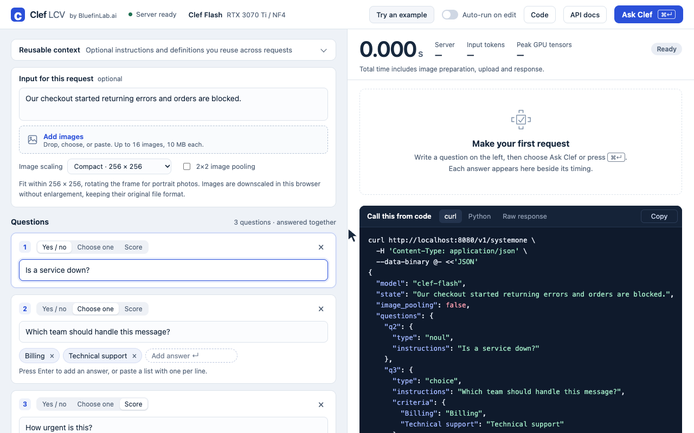

# Clef LCV

**Clef Local Inference, Caching, and Vision**

A self-hosted portal and API for Cloudflare's Clef decision models. Give it
context, one or more questions, and optional images; it returns typed answers
with probabilities and shows how long the browser round trip and server
inference took. It runs on a single NVIDIA GPU using 4-bit (NF4) weights.



*Run, edit a question, run again: each answer shows how it changed. Recorded
against a stand-in server, so the answers shown are illustrative.*

## Why Clef LCV

There are plenty of ways to classify documents with a model. This project fills
a narrower need: a high-quality decision model that runs entirely on local
hardware and can decide based on what's in an image, not just text.

The requirements were:

- **Quality:** document categorization on par with GPT Sol 6.1, the hosted reference model.
- **Images:** decisions based on image content as well as text.
- **Accessibility:** works offline and in air-gapped environments, with no calls
  to hosted services once the model is prepared.
- **Speed:** fast enough for interactive use on a single GPU.

### Decision models we tested

Each model classified the same [100 synthetic emails](benchmarks/email-sample/README.md)
into twelve categories with the same guide. The reference labels are GPT Sol 6.1's
categorizations of those emails, so "Matches GPT Sol 6.1" is how many of a model's
answers agreed with the reference model. Serial time is for all 100 emails, sent
one at a time.

| Model | Runs locally | Image input tested | Matches GPT Sol 6.1 | Serial time | Hardware |
|---|---|---|---:|---:|---|
| JEV 1.13.0 | No, hosted API | Not tested | 100/100 | 18.2 s | Hosted |
| Laya | Yes | Not tested | 42/100 | 14.0 s | RTX 2080 Ti |
| Laya Typed Decisions | Yes | Not tested | 36/100 | 14.1 s | RTX 2080 Ti |
| Decider 2B v11 | Yes | Not tested | 94/100 | 48.3 s | RTX 2080 Ti |
| Kev-4B Q8_0 | Yes | Not tested | 96/100 | 129.2 s | RTX 2080 Ti |
| Kev-9B Q4_K_M, community | Yes | Not tested | 100/100 | 179.4 s | RTX 2080 Ti |
| **Clef Flash 9B (this project)** | Yes | Yes, up to 16 per request | 96/100 | 65.2 s | RTX 2080 Ti |
| **Clef Flash 9B (this project)** | Yes | Yes, up to 16 per request | 96/100 | 60.0 s | RTX 3070 Ti |
| **Clef Flash 9B (this project)** | Yes | Yes, up to 16 per request | 96/100 | 43.4 s | RTX 3090 |
| **Clef Full 27B (this project)** | Yes | Yes, up to 16 per request | 100/100 | 126.4 s | RTX 3090 |

Most models ran on different GPUs and runtimes, and some were run outside their
default settings, so treat this as a fit-for-purpose check rather than a ranking.
Clef Flash gave the same answers on all three GPUs it was tested on.
Configurations, concurrent timings and caveats are in the
[comparison results](benchmarks/provider-comparison/README.md). Hosted
general-purpose models such as GPT Sol 6.1 aren't included in the published results.

### Where Clef fits

- **Clef Full** matched GPT Sol 6.1 on all 100 emails, runs locally and takes images.
  Kev-9B also matched all 100, but was slower in our tests and wasn't tested
  with images. JEV was fast and accurate, but needs an internet connection and
  an API key.
- **Clef Flash** gives up 4 of 100 matches for about three times Full's speed on
  the same RTX 3090, and runs on GPUs with 8 GB. On the RTX 2080 Ti used for the
  other local models, it was about 2.8 times faster than Kev-9B.
- **Offline:** once the weights are prepared, the service runs with `--offline`
  and makes no network calls. For an air-gapped host, prepare the model on a
  connected machine, then move the image and the prepared checkpoint across. See
  [reusing prepared weights](docs/unified-service.md#reuse-existing-prepared-weights).
- **Speed:** sent one at a time, Flash takes about 0.43 s per email on an
  RTX 3090 and 0.65 s on an RTX 2080 Ti; Full takes about 1.3 s on an RTX 3090.

## Models

Two models are supported:

| Profile | Model | Weights | Compute | Minimum GPU | Tested on |
|---|---|---|---|---|---|
| Flash (default) | Clef Flash 9B | NF4, compact NF4 embeddings | FP16 | 8 GB | RTX 3070 Ti, RTX 2080 Ti, RTX 3090 |
| Full | Clef 27B | NF4, dense BF16 embeddings | BF16 | 22 GiB with BF16 support | RTX 3090 |

## Features

- **Decision questions:** several `noul` (probability of yes), `choice` and
  `score` questions per request, answered together.
- **Images:** up to 16 per request by file picker, drag and drop or paste.
  The browser resizes them to a chosen preset, from Compact (256 × 256) to
  Original, keeping the PNG, JPEG or WebP format.
- **Testing portal:** the editor and response sit side by side. Each answer shows
  its confidence change since the last run and dims when its question is edited.
  Run with Cmd/Ctrl+Enter or optional auto-run, and mark answers correct or wrong.
- **Code examples:** copyable curl and Python for the request in the editor,
  using the server's own address and model ID.
- **Speed:** reuse of cached context, images and preprocessing across requests;
  incremental prefill for long inputs; optimized linear-attention kernels.
- **Capacity:** input limits are computed from the GPU's free memory and reported
  by `/v1/models`. Oversized requests are rejected rather than truncated.
- **Serving:** a FIFO queue in front of one GPU worker, `/health`, `/v1/models`,
  `/v1/systemone` and interactive API docs at `/docs`.

## Requirements

| | |
|---|---|
| GPU | One NVIDIA GPU, compute capability 7.5 (Turing) or newer. Flash needs 8 GB; Full needs 22 GiB and BF16. |
| Host | Linux x86_64 with an NVIDIA driver supporting CUDA 12.9 |
| Docker | Docker with the [NVIDIA Container Toolkit](https://docs.nvidia.com/datacenter/cloud-native/container-toolkit/latest/install-guide.html) |
| Disk | About 30 GB free for Flash or 85 GB for Full, plus the Docker image |

macOS, CPU-only hosts and GPUs older than Turing are not supported.

## Quick start with Docker

```sh
docker build -t clef:local .
docker run -d --name clef --gpus device=0 -p 8080:8080 \
  -v clef-cache:/data clef:local
docker logs -f clef
```

Open `http://localhost:8080/`. The first start downloads the pinned Flash release
(about 18 GB), prepares NF4 weights (about 4.9 GB) in the `clef-cache` volume,
then starts the service. This can take a while; progress is in the logs. Later
starts reuse the prepared weights. The first requests can still be slower while
GPU kernels compile; compiled kernels are cached in the same volume.

To run Full instead, on a 24 GB GPU, use the same image and volume:

```sh
docker stop clef
docker run -d --name clef-full --gpus device=0 -p 8080:8080 \
  -v clef-cache:/data clef:local --full
```

Each container serves one model on one GPU. To pin a specific card, pass its UUID
(`--gpus device=GPU-…`). Flash and Full are stored separately in the volume.

With Compose:

```sh
CLEF_GPU=0 docker compose up --build -d
CLEF_GPU=0 CLEF_PROFILE=full docker compose up -d   # Full instead
```

See [unified service and Docker](docs/unified-service.md) for the cache layout,
reusing existing weights, offline operation and pre-downloading.

## API

Send questions to `/v1/systemone`. This uses the example request in
[examples/request.json](examples/request.json):

```sh
curl http://localhost:8080/v1/systemone \
  -H 'Content-Type: application/json' \
  --data-binary @examples/request.json
```

The example uses the Flash model ID, `clef-flash`. For Full, change `model` to
`clef`. The portal's **Code** panel generates curl and Python for whatever is
in the editor.

The response contains `answers` and `usage`. Usage includes `latency_ms`
(processing), `queue_wait_ms`, `server_total_ms`, `input_tokens` and
`peak_allocated_mib`. A `noul` answer is a probability, not generated text;
`choice` and `score` answers are limited to the criteria you supply. This API
returns decisions, not free-form text.

Images are sent as base64 data URLs (PNG, JPEG or WebP), up to 10 MiB and 20
million pixels each. They count toward the input token limit after the vision
processor resizes them.

### Input limits

Check `GET /v1/models` before sending large requests:

```json
{
  "object": "list",
  "data": [
    {"id": "clef-flash", "object": "model", "max_input_tokens": 24576,
     "max_input_tokens_with_images": 24576}
  ]
}
```

`max_input_tokens` is estimated from the GPU's free memory and rounded down to
a 4K step. Use `max_input_tokens_with_images` for requests that include images.
The estimate is conservative but not a reservation: other GPU users can reduce
it. To set a fixed cap instead, start the service with `--max-length N`. See
[context budget discovery](docs/runtime-optimizations.md#context-budget-discovery).

### Errors and queueing

Each service has one inference worker. Concurrent requests wait in a FIFO queue
(up to 64 waiting, five-minute wait limit).

| Status | Meaning |
|---|---|
| 413 | Input exceeds the limit; the response includes `input_tokens` and `max_input_tokens` |
| 429 | Queue full; retry after the `Retry-After` header |
| 503 | The GPU ran out of memory |
| 504 | The request waited too long in the queue |

`/health` reports queue occupancy, the selected GPU strategy and active kernels.
See [request queue](docs/runtime-optimizations.md#request-queue).

## GPU support

| GPU family | Flash | Full | Physically tested |
|---|---|---|---|
| Turing SM75, e.g. RTX 2080 Ti | FP16, adaptive kernels | Not supported (no BF16, too little VRAM) | Flash |
| Ampere SM86, e.g. RTX 3070 Ti, 3090 | FP16, optimized kernels | BF16, optimized kernels (22 GiB or more) | Flash and Full |
| Ampere SM80, A100 | FP16, optimized kernels | BF16, optimized kernels | Not yet |
| Ada SM89, RTX 4090 | FP16, optimized kernels | BF16, optimized kernels | Not yet |
| Hopper SM90, H100 | FP16, optimized kernels | BF16, optimized kernels | Not yet |
| Blackwell SM120, RTX 5090 | FP16, optimized kernels | BF16, optimized kernels | Not yet |
| Other SM75+ | Native kernels, conservative limits | Native kernels if BF16 and enough VRAM | Not yet |

The untested families build and pass startup-policy tests, but still need
hardware validation. To check what the service would select on your GPU without
loading a model:

```sh
docker run --rm --gpus device=0 clef:local inspect
```

See [GPU support](docs/gpu-support.md) for build targets and smaller
single-architecture images.

## Running without Docker

Install `requirements/unified.txt` in a Python 3.11 environment, build the
convolution wheel for your GPU (see [optimized kernels](docs/optimized-kernels.md)),
then:

```sh
python -m clef_service --gpu 0          # Flash on port 8080
python -m clef_service --gpu 0 --full   # Full
python -m clef_service inspect --gpu 0  # show the selected GPU strategy
```

Run `python -m clef_service --help` for all options. Settings and environment
variables are described in [runtime optimizations](docs/runtime-optimizations.md)
and [model profiles](docs/builds.md). A systemd template is in
[deployment/](deployment/).

## Benchmarks

[benchmarks/email-sample](benchmarks/email-sample/README.md) contains 100
synthetic emails written for this project, labelled by GPT Sol 6.1, and a
runner that reports throughput, latency, queue time, cache reuse and agreement
with those reference labels:

```sh
python3 scripts/benchmark_emails.py --validate-only
python3 scripts/benchmark_emails.py --url http://localhost:8080 \
  --concurrencies 1,4 --passes 2 --cache on \
  --output local/benchmarks/email-cached.json
```

[benchmarks/provider-comparison](benchmarks/provider-comparison/README.md)
runs the same emails against Clef, TypeSafe JEV and other SystemOne-compatible
decision services, and records results from October 4, 2026.

## Known limitations

- **Long-context retrieval:** experimental long-context Flash tests showed
  inconsistent fact retrieval, even without chunking. See the
  [accuracy artifact](docs/long-context-accuracy-artifact.md).
- **Untested GPUs:** A100, RTX 4090, H100 and RTX 5090 are build targets only.
- **One request at a time:** requests are queued for a single GPU worker. GPU
  batching is a prototype; see [scheduling and batching](docs/scheduling-batching.md).
- **Engines:** only the Transformers/PyTorch implementation is included; Ollama
  and llama.cpp integrations are not.

## Documentation

| Topic | Document |
|---|---|
| Docker, cache layout and startup | [Unified service and container](docs/unified-service.md) |
| GPU targets and builds | [GPU support](docs/gpu-support.md) |
| Native installs and environment variables | [Model profiles](docs/builds.md) |
| Settings for caching, limits, prefill and the queue | [Runtime optimizations](docs/runtime-optimizations.md) |
| Kernel builds and tuning | [Optimized kernels](docs/optimized-kernels.md) |
| Image handling | [Image scaling](docs/image-scaling.md), [client image resizing](docs/client-image-resizing.md), [incremental prefill](docs/multimodal-prefill.md) |
| Caching | [Prefix cache benchmarks](docs/prefix-cache-benchmarks.md), [input cache benchmarks](docs/input-cache-benchmarks.md), [long-request cache](docs/long-request-cache.md), [cache accounting](docs/cache-accounting.md) |
| Experiments | [Language performance](docs/language-performance.md), [scheduling and batching](docs/scheduling-batching.md), [Full context quality](docs/full-context-quality.md) |
| Test results | [Validation record](docs/validation.md) |
| History | [Changelog](CHANGELOG.md) |

## Project layout

```text
clef_service/      Service: app, GPU detection, pinned downloads, NF4 preparation
runtime/           Inference helpers: prefill, context budget, caches, request queue
web/               Browser portal
profiles/          Pinned model revisions and per-profile defaults
requirements/      Pinned Python dependencies
vendor/cloudflare/ Unmodified Clef decision-head wrapper and its license
scripts/           Kernel builds, benchmarks, tests and legacy launcher
benchmarks/        Public email sample and provider comparison results
examples/          Example API request
deployment/        systemd template
docs/              Documentation and validation records
builds/            Legacy import wrappers
Dockerfile, compose.yaml
```

## Development checks

These run without a GPU or network:

```sh
python3 scripts/check_project.py
python3 scripts/test_email_benchmark.py
python3 scripts/test_provider_benchmark.py
node scripts/test_image_scaling.js
```

## License

The code in this repository is licensed under the [Apache License 2.0](LICENSE).
The vendored Cloudflare wrapper keeps its own license, and model weights are
downloaded at runtime under Cloudflare's release terms. See
[THIRD_PARTY.md](THIRD_PARTY.md).
